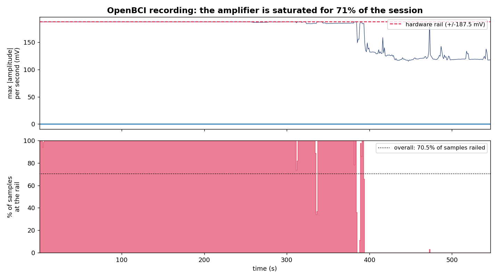

## Bottom line

We did a signal-level analysis of the recording before training. There is a
data-quality problem that prevents meaningful training on this file. This is not
a modelling failure and not a dead end: it is fixable with one clean re-recording
plus a small preprocessing change. The pipeline we have already built will then
become meaningful.

## Finding 1: the amplifier was railed (saturated) for 70% of the session

In 70.5% of all samples, at least one of the eight channels is pegged at the
hardware rail (the Cyton's full-scale limit, plus or minus 187500 microvolts at
gain 24). A railed input is not signal: it is a clipped, flat-topped reading,
caused by electrode contact, impedance, or gain. As the figure shows, the input
sits at the rail for roughly the first 390 seconds and only settles into a sane
range in the final ~150 seconds.

A side effect: clipping is a square wave, so it dumps energy into every frequency
band. The high-frequency "bursts" that could look like muscle activity are
clipping artifact, not EMG.

## Finding 2: where the data is clean, the real muscle signal is weak and unfiltered

In the ~30% of the recording that is not railed, there is some genuine bicep EMG,
but it is weak and buried under low-frequency baseline drift. Even in the best
clean windows the muscle-band (20 to 100 Hz) power never rises above about 35% of
the sub-5 Hz drift power, and the current pipeline applies no high-pass filter to
remove that drift. There was also no timed flex/rest protocol, so the muscle
activity has no clear structure to learn from. In short, on this recording we
cannot reliably tell muscle activity from drift and noise.

## Finding 3: the model scores do not survive a fair test

We also checked the models themselves on this data:

- The forecasting LSTM reports RMSE 0.1945. A one-line linear extrapolation
  ("continue the straight line") scores 0.1696 on the same test segment, which is
  better. The LSTM is not beating a trivial baseline.
- The classifier reports 97.6% accuracy. That figure comes from overlapping
  windows split randomly between training and test, which leaks near-duplicate
  data across the split. Under an honest split (hold out whole segments), a
  trivial three-feature logistic regression already reaches about 80%, and the
  LSTM adds nothing on top of the correlation that defines the labels.

So the strong numbers reflect the test setup, not learned muscle patterns.

## What we recommend

The rig and the pipeline are fine. The recording is the problem. To get
trainable data we need:

1. **Fix the railing at the source** (electrode contact, skin preparation,
   impedance, gain) so channels sit in a sane microvolt range and stop clipping.
2. **Add a high-pass filter** (around 10 to 20 Hz) in preprocessing to remove the
   baseline drift that currently swamps the muscle signal. This is a code change.
3. **Record with a timed protocol** (for example 5 seconds rest, 5 seconds flex,
   repeated) so the muscle bursts are high-contrast and labellable, and define a
   "valid pattern" by muscle-band activity during flex rather than by raw
   channel correlation.

With those three changes, one good recording gives us data we can actually train
on, and the existing scripts (now corrected for the leakage and with proper
baselines) will produce numbers that mean something.

*Supporting analysis, plots, and the corrected scripts are available on request.*
